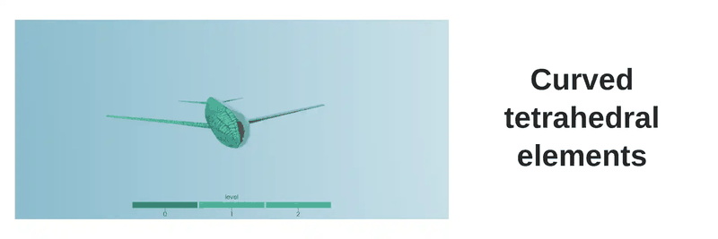
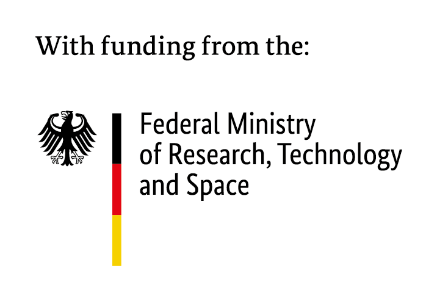
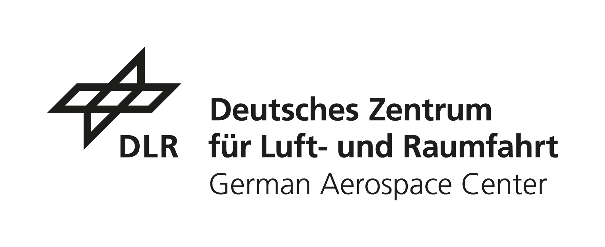
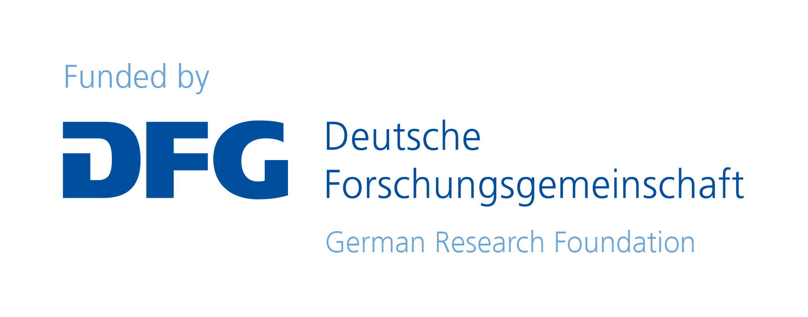

[](https://doi.org/10.5281/zenodo.7034838)
[](https://github.com/DLR-AMR/t8code/actions/workflows/testsuite.yml)
[](https://codecov.io/gh/dlr-amr/t8code)
[](https://t8code.readthedocs.io/en/latest/)
[](COPYING)
[](https://github.com/DLR-AMR/t8code/releases)

<p align="center">
  
</p>

<p align="center">
<b>A C/C++ library for parallel adaptive mesh refinement on forests of octrees, tetrahedra, and more - scaling to over a million CPU cores.</b>
</p>

<div align="center">

[Overview](#overview) -
[Gallery](#gallery) -
[Features](#features) -
[Getting Started](#getting-started) -
[Documentation](#documentation) -
[Get Help](#get-help) -
[License and Contributing](#license-and-contributing) -
[Funding](#funding) -
[Julia Wrapper](#julia-wrapper) -
[Citing t8code](#citing-t8code) -
[Publications](#publications)

</div>

## Overview

`t8code` (pronounced "tetcode") is a C/C++ library for managing parallel adaptive meshes, intended to be used as a third-party library inside numerical simulation codes or other applications that profit from meshes. Its main purpose is Adaptive Mesh Refinement (AMR): automatically refining a mesh wherever a simulation needs more detail (e.g. a shock front, a boundary layer, a chemical plume) while keeping it coarse everywhere else, so that the compute time and memory are used mostly for the regions of interest. Depending on the problem, this can speed up a simulation by orders of magnitude compared to a uniformly fine mesh. `t8code` keeps this refinement fast and scalable even when it has to happen simultaneously across thousands to millions of processor cores while the mesh keeps changing during the simulation, managing a collection (a forest) of multiple connected adaptive space-trees to do so efficiently - scaling to at least one million MPI ranks and over 1 trillion mesh elements. As a side effect of managing this distributed mesh, `t8code` also makes it comparatively easy to parallelize a simulation code built on top of it, gaining AMR along the way.

## Gallery

Some examples on usage scenarios for `t8code`. More detailed descriptions are below.

<div align="center">

</div>

<details>
<summary>Descriptions</summary>

- **Curved tetrahedral elements**<br>
  The curved geometry module uses original CAD data for the refinement and curvature of elements. The resulting geometrical accuracy is exact and the application can therefore use arbitrary high polynomial element degrees. [Fus23]
- **Atmospheric simulations**<br>
  Todo
- **2D Riemann on GPU**<br>
  A 2D Riemann simulation calculated on our experimental GPU solver [`t8gpu`](https://github.com/DLR-AMR/t8gpu) using `t8code` for mesh management.
- **Curved hybrid meshes**<br>
  The curved geometry is implemented for different element shapes, which enables different curved element shapes in the same mesh. [Els22, Fus23]
- **Simulation data visualization**<br>
  Todo
- **NSU3D RANS over DLR-F6**<br>
  NSU3D computed pressure distribution on adaptively refined meshes for RANS simulation of flow over DLR-F6 wing-body, using `t8code` for dynamic AMR as described in [MK26].
- **Mesh deformation**<br>
  DG Euler simulation on an adaptive t8code mesh with Radial Basis Function based mesh deformation. [Ric26]

</details>

## Features

**Element types** - `t8code` supports the following element types, including hybrid meshes that combine several types of the same dimension:

- 0D: vertices
- 1D: lines
- 2D: quadrilaterals and triangles
- 3D: hexahedra, tetrahedra, prisms and pyramids

**Mesh operations** - among others, `t8code` offers the following functionalities:

- Manage distributed adaptive meshes over complex domain geometries
- Adapt meshes according to user given refinement/coarsening criteria
- Establish a 2:1 balance
- (Re-)partition a mesh (and associated data) among MPI ranks
- Manage ghost (halo) elements and data
- Hierarchical search in the mesh
- Curved mesh elements

**Scalability** - `t8code` scales to at least one million MPI ranks and over 1 trillion mesh elements.

**Pluggable space-filling curves (SFCs)** - `t8code` uses space-filling curves to manage the adaptive refinement and to efficiently store the mesh elements and associated data.
A modular approach makes it possible to exchange the underlying SFC without changing the high-level algorithms.
Thus, we can use and compare different refinement schemes, and users can implement their own refinement rules if so desired.
Currently, `t8code` offers the following implementations by default:

- lines use a 1D Morton curve with 1:2 refinement
- quadrilateral/hexahedral elements are inherited from the p4est submodule, using the Morton curve 1:4, 1:8 refinement
- triangular/tetrahedral elements are implemented using the Tetrahedral Morton (TM) curve, 1:4, 1:8 refinement
- prisms are implemented using the triangular TM curve and a line curve, 1:8 refinement
- pyramids are implemented using the Pyramidal Morton curve and the TM curve for its tetrahedral children, 1:10 (for pyramids) / 1:8 (for tetrahedra) refinement

You find more information on `t8code` in the [wiki](https://github.com/DLR-AMR/t8code/wiki).
For a brief introduction to AMR and the algorithms used by `t8code`, we recommend reading our [overview paper](https://elib.dlr.de/194377/1/t8code_overview_IMR2023.pdf).

## Getting Started

We provide a short guide to install `t8code` in our wiki [Installation guide](https://github.com/DLR-AMR/t8code/wiki/Installation).

To get familiar with `t8code` and its algorithms and data structures, we recommend executing the tutorial examples in `tutorials`
and reading the corresponding Wiki pages, starting with [Step 0 - Helloworld](https://github.com/DLR-AMR/t8code/wiki/Step-0---Hello-World).

An example of a complete numerical simulation is our basic finite volume solver of the advection equation in `example/advection`.

## Documentation

`t8code` uses [Doxygen](https://doxygen.nl/) to generate the code documentation.
You can find the documentation on [readthedocs](https://t8code.readthedocs.io/en/latest/).
Follow the steps described in our Wiki [Documentation](https://github.com/DLR-AMR/t8code/wiki/Documentation) to create the documentation locally.

## Get Help

- **Bug reports and feature requests:** please [open an issue](https://github.com/DLR-AMR/t8code/issues/new).
- **Usage questions and general discussion:** please use [GitHub Discussions](https://github.com/DLR-AMR/t8code/discussions).
- **Matrix community:** we run a Matrix community space for more direct exchange with the developers. There is no public invite link, just open an issue or a discussion asking to join and we will get you an invite.
- You are also welcome to write an email to one of the principal developers.

## License and Contributing

`t8code` is licensed under GPLv2 (see [COPYING](COPYING)). Copyright (c) 2015-2026 the developers. We appreciate
contributions from the community and refer to [CONTRIBUTING.md](CONTRIBUTING.md) and the guides in our [wiki](https://github.com/DLR-AMR/t8code/wiki) for more details.

Note that we strive to be a friendly, inclusive open-source
community and ask all members of our community to adhere to our
[CODE_OF_CONDUCT.md](CODE_OF_CONDUCT.md).

## Funding

Development of `t8code` has been funded by the following institutions:

<table cellpadding="20" cellspacing="0" border="0" bgcolor="#ffffff">
  <tr>
    <td align="center" valign="top" bgcolor="#ffffff"></td>
    <td align="center" valign="top" bgcolor="#ffffff"></td>
    <td align="center" valign="top" bgcolor="#ffffff"></td>
  </tr>
  <tr>
    <td align="center" valign="middle" bgcolor="#ffffff"></td>
    <td align="center" valign="middle" bgcolor="#ffffff"></td>
    <td align="center" valign="middle" bgcolor="#ffffff"></td>
  </tr>
</table>

## Julia Wrapper

We offer [T8code.jl](https://github.com/DLR-AMR/T8code.jl) - an official
[Julia](https://julialang.org/) package allowing to call `t8code` routines from
the [Julia](https://julialang.org/) programming language. From within a Julia
session do
```julia
julia> import Pkg; Pkg.add(["T8code", "MPI"])
```
to install the package on your system.

## Citing `t8code`

If you use `t8code` in any of your publications, please cite the GitHub repository via the [Zenodo DOI](https://doi.org/10.5281/zenodo.7034838), as well as [HBK+23] and [Hol18]. For publications specifically related to
- **the tetrahedral index**, please cite [BH16].
- **coarse mesh partitioning**, please cite [BH17].
- **construction and handling of the ghost layer**, please cite [HKB21].
- **geometry controlled refinement**, please cite [EHKR22] (general) and [Fus23] (tetrahedral).
- **hanging node resolution and/or subelements**, please cite [Bec21] and [Lei24].

If you use any functionality described in the theses, we encourage you to cite them as well.

## Publications

An (incomplete) list of publications related to `t8code`:

[HBK+23] **Overview Paper**:
Holke, Johannes and Burstedde, Carsten and Knapp, David and Dreyer, Lukas and Elsweijer, Sandro and Ünlü, Veli and Markert, Johannes and Lilikakis, Ioannis and Böing, Niklas and Ponnusamy, Prasanna and Basermann, Achim (2023) *t8code v. 1.0 - Modular Adaptive Mesh Refinement in the Exascale Era*. SIAM International Meshing Round Table 2023, 06.03.2023 - 09.03.2023, Amsterdam, Niederlande.
[Full text available](https://elib.dlr.de/194377/1/t8code_overview_IMR2023.pdf)

[Hol18] **Original PhD thesis**:
Holke, Johannes *Scalable algorithms for parallel tree-based adaptive mesh refinement with general element types*, PhD thesis at University of Bonn, 2018,
[Full text available](https://bonndoc.ulb.uni-bonn.de/xmlui/handle/20.500.11811/7661)

[BH16] **Tetrahedral and triangular Space-filling curve**:
Burstedde, Carsten and Holke, Johannes *A Tetrahedral Space-Filling Curve for Nonconforming Adaptive Meshes*, SIAM Journal on Scientific Computing, 2016, [10.1137/15M1040049](https://epubs.siam.org/doi/10.1137/15M1040049)

[BH17] **Coarse mesh partitioning**:
Burstedde, Carsten and Holke, Johannes *Coarse mesh partitioning for tree-based AMR*, SIAM Journal on Scientific Computing, 2017, [10.1137/16M1103518](https://epubs.siam.org/doi/10.1137/16M1103518)

[HKB21] **Ghost computation**:
Holke, Johannes and Knapp, David and Burstedde, Carsten *An Optimized, Parallel Computation of the Ghost Layer for Adaptive Hybrid Forest Meshes*, SIAM Journal on Scientific Computing, 2021, [10.1137/20M1383033](https://epubs.siam.org/doi/abs/10.1137/20M1383033)

[EHKR22] **Geometry controlled refinement for hexahedra**:
Elsweijer, Sandro and Holke, Johannes and Kleinert, Jan and Reith, Dirk (2022) *Constructing a Volume Geometry Map for Hexahedra with Curved Boundary Geometries*. In: SIAM International Meshing Roundtable Workshop 2022. SIAM International Meshing Roundtable Workshop 2022, 22. - 25. Feb. 2022, [Full text available](https://elib.dlr.de/186570/1/ConstructingAVolumeGeometryMapForHexahedraWithCurvedBoundaryGeometries.pdf)

[HM+25] **JOSS entry**:
Holke, Johannes and Markert, Johannes, et al. (2025) *t8code - modular adaptive mesh refinement in the exascale era*. In: Journal of Open Source Software, [Full text available](https://www.theoj.org/joss-papers/joss.06887/10.21105.joss.06887.pdf)

[DHK+25] **Book chapter**:
Dreyer, Lukas and Hergl, Chiara and Knapp, David and Elsweijer, Sandro and Markert, Johannes and Böing, Niklas and Ponnusamy, Prasanna and Holke, Johannes (2025) *t8code - Scalable Adaptive Mesh Refinement*. In: Emerging Technologies in Computational Sciences for Industry, Sustainability and Innovation, Springer Nature Switzerland, [10.1007/978-3-031-95709-3_23](https://doi.org/10.1007/978-3-031-95709-3_23)

[MK26] **NSU3D and FUN3D coupling for WMLES**:
Mavriplis, Dimitri J. and Kirby, Andrew C. (2026) *Dynamic Adaptive Mesh Refinement for WMLES on Complex Configurations*. AIAA SciTech Forum, [10.2514/6.2026-0703](https://arc.aiaa.org/doi/10.2514/6.2026-0703)

### Theses with `t8code` relations

An (incomplete) list of theses written with or about `t8code`:

[Kna17] **Prism space-filling curve**:
Knapp, David (2017) *Adaptive Verfeinerung von Prismen*. Bachelor's thesis, Rheinische Friedrich-Wilhems-Universität Bonn.

[Kna20] **Pyramidal space-filling curve**:
Knapp, David (2020) *A space-filling curve for pyramidal adaptive mesh refinement*. Master's thesis, Rheinische Friedrich-Wilhems-Universität Bonn. [Full text available](https://www.researchgate.net/publication/346789160_A_space-filling_curve_for_pyramidal_adaptive_mesh_refinement)

[Dre21] **DG solver based on t8code**:
Dreyer, Lukas (2021) *The local discontinuous galerkin method for the advection-diffusion equation on adaptive meshes*. Master's thesis, Rheinische Friedrich-Wilhems-Universität Bonn.
[Full text available](https://elib.dlr.de/143969/1/masterthesis_dreyer.pdf)

[Els21] **Geometry controlled refinement for hexahedra (Part 1)**:
Elsweijer, Sandro (2021) *Curved Domain Adaptive Mesh Refinement with Hexahedra*. Tech report, Hochschule Bonn-Rhein-Sieg.
[Full text available](https://elib.dlr.de/186571/1/masterprojekt-2_elsweijer_ABGABEVERSION_TITEL.pdf)

[Bec21] **Subelement and resolving hanging faces in 2D**:
Becker, Florian (2021) *Removing hanging faces from tree-based adaptive meshes for numerical simulation*, Master's thesis, Universität zu Köln.
[Full text available](https://elib.dlr.de/187499/1/RemovingHangingFacesFromTreeBasedAMR.pdf)

[Spa21] **Coarsening as post-processing to reduce simulation file size**:
Spataro, Luca (2021) *Lossy data compression for atmospheric chemistry using adaptive mesh coarsening*. Master's thesis, Technische Universität München.
[Full text available](https://elib.dlr.de/144997/1/master-thesis-final-spataro.pdf)

[Els22] **Geometry controlled refinement for hexahedra (Part 2)**:
Elsweijer, Sandro (2022) *Evaluation and generic application scenarios for curved hexahedral adaptive mesh refinement*. Master's thesis, Hochschule Bonn-Rhein-Sieg. [10.13140/RG.2.2.34714.11203](https://doi.org/10.13140/RG.2.2.34714.11203) [Full text available](https://elib.dlr.de/186561/1/sandro_elsweijer-evaluation_and_generic_application_scenarios_for_curved_hexahedral_adaptive_mesh_refinement.pdf)

[Boi22] **Multigrid and other preconditioners for DG**:
Böing, Niklas (2022) *Evaluation of preconditioners for implicit solvers of local DG for the advection-diffusion equation* (*Untersuchung von Präkonditionierern für implizite Löser für das Local DG-Verfahren zur Lösung der Advektions-Diffusionsgleichung*). Master's thesis, Universität zu Köln.
[Full text available](https://elib.dlr.de/186347/1/Untersuchung%20von%20Pr%C3%A4konditionierern%20f%C3%BCr%20implizite%20L%C3%B6ser%20f%C3%BCr%20das%20Local%20DG-Verfahren%20zur%20L%C3%B6sung%20der%20Advektions-Diffusionsgleichung.pdf)

[Lil22] **Removing elements from the mesh (cutting holes)**:
Lilikakis, Ioannis (2022) *Algorithms for tree-based adaptive meshes with incomplete trees*. Master's thesis, Universität zu Köln.
[Full text may be available in future](https://elib.dlr.de/191968/)

[Fus23] **Curved tetrahedra**:
Fussbroich, Jakob (2023) *Towards high-order, hybrid adaptive mesh refinement: Implementation and evaluation of curved unstructured mesh elements*. Master's thesis, Technische Hochschule Köln.
[Full text available](https://elib.dlr.de/200442/)

[Lei24] **Hanging node resolution 3D**:
Leistikow, Tabea (2024) *Derivation and implementation of a hanging nodes resolution scheme for hexahedral non-conforming meshes in t8code*. Master's thesis, Universität zu Köln.
[Full text available](https://elib.dlr.de/204843/)

[Hen24] **Ghost interface and search for arbitrary neighborhood types**:
Henric-Petri, Antje Nadine (2024) *Ghost-Interface und -Suche für beliebige Nachbarschaftstypen in einem parallelen adaptiven Mesh*. Bachelor's thesis, Rheinische Friedrich-Wilhelms-Universität Bonn.
[Full text available](https://elib.dlr.de/210189/1/BA.pdf)

[Ric26] **CAD-based mesh deformation using radial basis function interpolation**:
Richter, Lena-Rene (2026) *CAD-Based Mesh Deformation on Adaptive Grids using Radial Basis Function Interpolation*. Master's thesis, Universität Mannheim.
[Full text will be available in future](https://elib.dlr.de/226671/)
